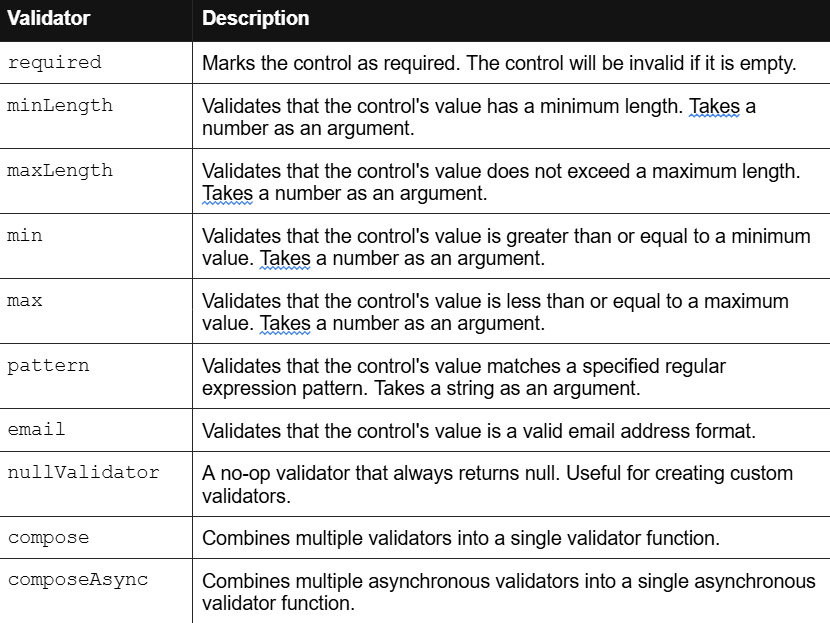
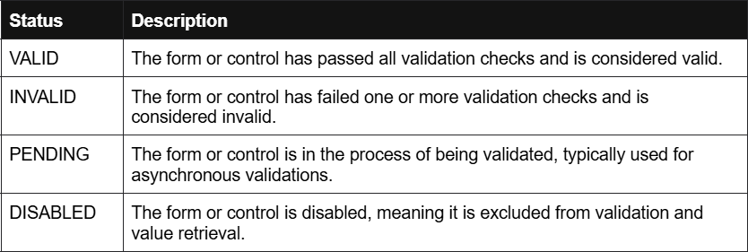

## a) ¿Qué son, para qué sirven y cómo se utilizan FormControl, FormGroup y FormBuilder?
- FormControl: representa un elemento de formulario individual en el template. Sirve porque un formulario reactivo es una agrupación de FormControls. Además, este se encarga de asignar los valores iniciales y las validaciones
- FormGroups: sirve para agrupar varios campos del formulario bajo un grupo, ya que la mayoria de formularios se componen de varios elementos. Asi que podriamos decir que son un elemento usado para agrupar campos.
- FormBuilder: este elemento es esencialmente sintactic sugar para poder acortar la cantidad de código escrita para hacer un FormGroup sin perder su utilidad. Sirve para poder crear los FormGroups de una forma más limpia sin, por ejemplo, tener que llamar a new para cada FormGroup o FormControl.

## b) Busca en la página oficial de Angular (o utiliza un recurso de O’Reilly) en el que se especifiquen todos los validadores que incluye Angular para ser utilizados en los formularios reactivos. Construye una tabla de resumen de estos.

## c) ¿Qué son, cuáles son y para qué sirven los estados en los formularios reactivos?
- Son los estados en los que se puede encontrar el formulario reactivo. En la siguiente tabla explico los posibles estados:

